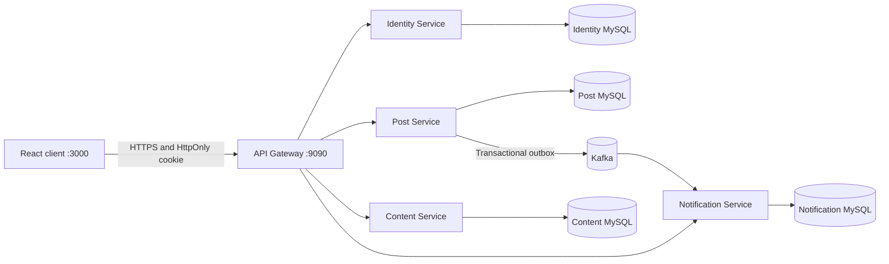

# Microservices Frontend

Clean React frontend for the Spring Boot blogging API. This project is intentionally lightweight: it gives the backend portfolio a professional user-facing entry point without shifting the main focus away from backend and platform engineering.

**Status:** local integration, Jenkins CI, and local Kubernetes deployment are complete through the API Gateway. AWS deployment is intentionally deferred.

Backend repository: [studywithdanish/microservices-backend](https://github.com/studywithdanish/microservices-backend)

## Architecture



The client uses only `VITE_API_BASE_URL`; service addresses remain private behind the gateway. The browser never reads the JWT: Identity Service issues it as an `HttpOnly` cookie and the gateway translates that cookie to an internal bearer header.

## Tech Stack

- React with TypeScript
- React Router
- TanStack React Query
- Bootstrap
- Axios
- React Toastify
- Vite and Vitest
- React Testing Library and Playwright

## Current Scope

- Home page with backend connection summary
- Login form connected to `/api/v1/auth/login`
- Signup form connected to `/api/v1/auth/register`
- Registration validation aligned with the backend 8–72 character password contract
- Protected dashboard loading the current Identity profile, Content categories, and Post results
- React Context-based session state shared by routes, navigation, and pages
- Secure `HttpOnly`, `SameSite` authentication cookies with no JWT in browser storage
- Central credentialed Axios client and expired-session handling
- React Query caching, invalidation, background notification refresh, and mutation state
- Authenticated post creation through `/api/posts`
- Server-side post pagination and keyword search
- Owner/admin post editing and two-step deletion
- Public comment loading plus authenticated comment creation and owner/admin deletion
- Kafka-backed notification feed with unread state and mark-as-read actions
- Feature-oriented dashboard components coordinated by a reusable custom hook
- Basic about and capabilities pages
- Environment-based backend URL configuration
- Docker and Nginx production runtime
- Clean Bootstrap layout for portfolio presentation

## Runtime Requirement

Use Node 22.12+ for local development and CI. The Docker build uses Node 22.

## Run Locally

Install dependencies:

```bash
npm install
```

Create local environment file:

```bash
cp .env.example .env
```

Start the app:

```bash
npm start
```

The frontend runs at:

```text
http://localhost:3000
```

By default it expects the backend at:

```text
http://localhost:9090
```

For a fresh end-to-end run, start the backend Docker Compose stack first. Register, log in, create a post in the default `General` category, load its comments, and add a comment from the dashboard.

## Environment Variables

Use `.env.example` as the reference:

```text
VITE_API_BASE_URL=http://localhost:9090
FRONTEND_PORT=3000
```

Use `.env.production.example` as the deployment reference. For deployed environments, set `VITE_API_BASE_URL` to the live backend URL before building the frontend. Prefer `/` when the frontend and gateway are exposed through the same reverse proxy.

## Quality Checks

Run tests:

```bash
npm run test:ci
```

Run the TypeScript compiler and the browser-level authentication test:

```bash
npm run typecheck
npm run test:e2e
```

Create a production build:

```bash
npm run build
```

Run the production dependency audit:

```bash
npm run security:audit
```

The production audit checks runtime dependencies with `npm audit --omit=dev`. The deployed Docker image serves static assets through Nginx and does not ship the Node build toolchain.

Vitest covers application routing, the authentication context, credentialed HTTP behavior, registration validation, multi-service dashboard loading, pagination, post/comment workflows, and Kafka notification state. Playwright verifies login, creation of an `HttpOnly` cookie, restoration of the server session, protected navigation, and dashboard rendering in a real browser.

## React Learning Guide

Use [`docs/REACT_LEARNING_GUIDE.md`](docs/REACT_LEARNING_GUIDE.md) to study this application feature by feature. It maps the implementation to the React concepts you should be able to explain in an interview and includes practical exercises that build on the current code.

## Docker Runtime

Build the production image:

```bash
docker build --build-arg VITE_API_BASE_URL=http://localhost:9090 -t blog-frontend .
```

Run the production container:

```bash
docker run --rm -p 3000:80 blog-frontend
```

Or use Docker Compose:

```bash
docker compose up --build
```

For a deployed environment, pass the live backend URL at build time:

```bash
docker build --build-arg VITE_API_BASE_URL=https://your-domain.com -t blog-frontend .
```

The container serves the React build through Nginx and supports client-side routing refreshes for pages like `/login` and `/signup`.

In production, the public reverse proxy should route `/api/**` to the gateway on the same HTTPS domain and `VITE_API_BASE_URL` can be `/`. Same-origin routing works naturally with the secure cookie and avoids unnecessary cross-origin complexity.

## Jenkins Pipeline

The repository-level `Jenkinsfile` runs the complete frontend CI flow:

- Clean dependency installation with `npm ci`
- TypeScript validation, unit/integration tests, and a Playwright browser test
- Production dependency vulnerability audit
- Optimized React production build
- Versioned and `latest` Docker image builds
- Build artifact archival and workspace cleanup

The local Windows Jenkins agent expects Node.js in `D:\\Softwares` and a system Chrome installation for Playwright. It uses `C:\\JenkinsWorkspaces\\microservices-frontend-ci`; Linux agents should replace the Windows-specific `customWorkspace` with an appropriate agent path and install a Playwright-compatible browser.

## Kubernetes Runtime

The backend repository owns the full Kubernetes topology and deploys this frontend as an Nginx container. Nginx serves the React application and proxies same-origin `/api/**` and `/actuator/**` requests to the internal API Gateway.

Follow the backend repository's `deploy/k8s/README.md` runbook to build the frontend image, deploy the platform, and run the cross-service smoke test.

## Dependency And Security Notes

Current production-oriented setup:

- Removed Reactstrap to avoid an unnecessary wrapper dependency and React peer-version warnings
- Removed unused web-vitals code from the runtime bundle
- Replaced Create React App with Vite
- Migrated the application to strict TypeScript
- Moved test/build tooling to `devDependencies`
- Added a production dependency audit script
- Kept the runtime image on Nginx instead of a Node server
- Removed readable JWT storage from the browser

`SameSite=Lax` is appropriate for the same-site deployment shown here. If a future UI and API intentionally run on different sites, introduce an explicit CSRF-token design before changing the cookie to `SameSite=None`.

## Portfolio Positioning

This frontend supports full-stack role screening while keeping the project backend-led. It now demonstrates modern React, TypeScript, server-state management, secure browser authentication, component/integration testing, browser automation, Docker, and Jenkins. The backend repository retains the main engineering depth: Spring Boot 3, Spring Security 6, JWT, API Gateway, database-per-service ownership, Kafka, Docker, Kubernetes, Jenkins, tests, Actuator, and the microservices migration history.
